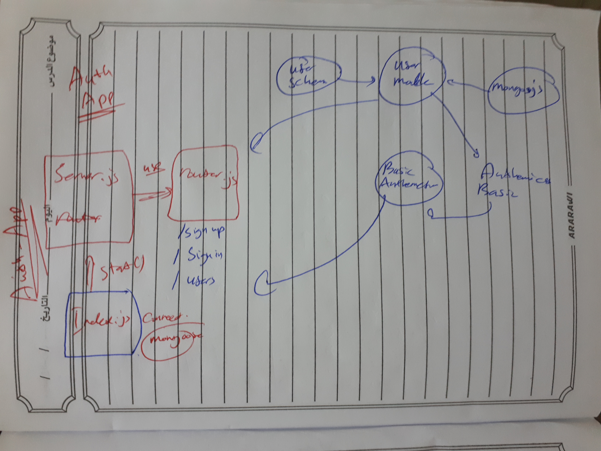

# Auth-server
auth-server / for classes 11 -12- 13 - 14

## Author: Ahmad Mamdouh AlHabrawi.

## Setup
.env requirements
* PORT - 3030
* MONGODB_URI - mongodb://localhost:27017/authserver
* CLIENT_ID - 13919678b29846514b47
* CLIENT_SECRET - 2ab5e556b0d2b1a785591e6f910034ac4e2f41f9
* API_SERVER - http://localhost:3030/oauth

## How to initialize/run this application
* nodemon
* npm start

## Tests
* npm run lint
* npm test

## UML

